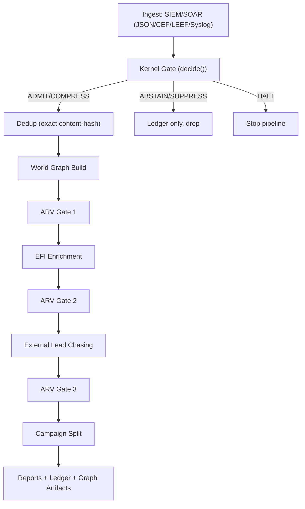

# AxoDen Canonical Blueprint (CIX-Alerts Consolidated)

**Status:** Operational (Dockerized)
**Scope:** Single canonical pipeline for CIX-Alerts using AxoDen Kernel SDK gating + SFA-style dedup + CIX graph forensics
**API Port:** 8009

## 1. Purpose
This document is the single canonical blueprint for CIX-Alerts after consolidation. It replaces legacy, split flows by defining one deterministic pipeline:

- Ingest SIEM/SOAR telemetry
- Kernel decision gate (AxoDen Kernel SDK)
- Exact content-hash dedup (SFA-style)
- Graph construction and forensic enrichment
- ARV gates and campaign reporting

All runtime behavior must follow this flow. Any legacy documents are advisory only.

## 2. Authoritative References
- Kernel math contract: `docs/axoden_soc_kernel_math_contract.md`
- Conformance profile: `docs/axoden_soc_conformance_profile.yaml`
- Kernel SDK repo: `/Users/erkanyalcinkaya/projects/axoden-kernel`

## 3. Canonical Flow (Single Pipeline)

### 3.1 Stage 0: Ingest
- Input formats: JSON, CEF, LEEF, Syslog
- Source: SIEM/SOAR telemetry
- Entry point:
  - CLI graph run: `main.py`
  - API: `POST /api/v1/ingest/classify` (Stage 1 only, does not build graphs)

### 3.2 Stage 1: Kernel Gate (Entropy + Safety)
- Uses AxoDen Kernel SDK `decide()` with `profile.cix`
- Evidence objects are built and hashed prior to any graph build
- Decision outcomes:
  - `ARV.ADMIT` or `ARV.COMPRESS` -> proceed
  - `ARV.ABSTAIN` / `ARV.SUPPRESS` -> drop (ledger only)
  - `ARV.HALT` -> stop pipeline

### 3.3 Stage 2: Dedup (Exact Content Hash)
- Applies SFA-style exact content hash deduplication
- Drops duplicates before graph build
- No duplicate evidence is emitted for dedupbed items

### 3.4 Stage 3: Graph Build + ARV Gate 1
- Build world graph from admitted, deduped events
- ARV Gate 1 checks graph size and baseline stability

### 3.5 Stage 4: EFI Enrichment + ARV Gate 2
- EFI enrichment via VT/OTX/NVD/LLM (bounded by profile)
- ARV Gate 2 checks drift and enrichment stability

### 3.6 Stage 5: External Lead Chasing + ARV Gate 3
- Brave search and artifact refinement
- ARV Gate 3 checks correlation risk

### 3.7 Stage 6: Campaign Split + Reports
- Connected components -> campaign subgraphs
- Outputs:
  - Forensic Assessment report
  - Forensic ledger
  - Interactive HTML graph
  - Campaign snapshot HTML

## 4. Wiring Diagram


## 5. Execution Paths

### 5.1 Graph Pipeline (Canonical)
```bash
export AXODEN_KERNEL_PATH=/Users/erkanyalcinkaya/projects/axoden-kernel
python3 main.py soc_alert_batch.json
```

### 5.2 API Ingest (Stage 1 only)
```bash
curl -X POST http://localhost:8009/api/v1/ingest/classify \
  -H "Content-Type: application/json" \
  -d '{"events":[{"source_id":"demo","event_id":"e1","source_timestamp":"2026-02-03T12:00:00Z","raw_payload":{"message":"test"}}]}'
```

## 6. Output Artifacts
- `data/ledger.jsonl` (API ingest only)
- `data/kernel_ledger.jsonl` (Kernel evidence ledger)
- `data/Forensic_Assessment_Campaign_*.md`
- `data/forensic_ledger_campaign_*.json`
- `data/investigation_graph_campaign_*.html`
- `data/campaign_snapshot_*.html`

## 7. Non-Negotiable Invariants
- Evidence objects are hashed before graph build and never mutated after hashing
- Dedup occurs after kernel gate and before graph build
- Only admitted and deduped events enter the graph
- Ledger entries are append-only and hash chained

## 8. Source Mapping (Implementation)
- Kernel gate: `src/kernel/kernel_gate.py`
- Dedup: `src/ingest/dedup.py`
- Graph build: `src/graph.py`
- Enrichment: `src/enrichment.py`
- Lead chasing: `src/chaser.py`, `src/refiner.py`
- Reports: `src/synthesis.py`, `src/visualize.py`, `src/audit.py`
