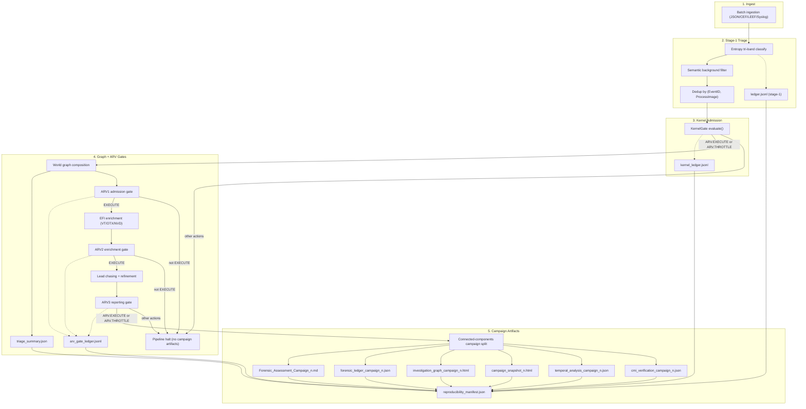

# AxoDen Canonical Blueprint (CIX-Alerts Consolidated)

**Status:** Operational (Dockerized)
**Scope:** Single canonical pipeline for CIX-Alerts using AxoDen Kernel SDK gating + SFA-style dedup + CIX graph forensics
**API Port:** 8009

## 1. Purpose
This document is the single canonical blueprint for CIX-Alerts after consolidation. It replaces legacy, split flows by defining one deterministic pipeline:

- Ingest SIEM/SOAR telemetry
- Kernel decision gate (AxoDen Kernel SDK)
- Exact content-hash dedup (SFA-style)
- Graph construction and forensic enrichment
- ARV gates and campaign reporting

All runtime behavior must follow this flow. Any legacy documents are advisory only.

## 2. Authoritative References
- Kernel math contract: `docs/axoden_soc_kernel_math_contract.md`
- Conformance profile: `docs/axoden_soc_conformance_profile.yaml`
- Kernel SDK repo: `/Users/erkanyalcinkaya/projects/axoden-kernel`

## 3. Canonical Flow (Single Pipeline)

### 3.1 Stage 0: Ingest
- Input formats: JSON, CEF, LEEF, Syslog
- Source: SIEM/SOAR telemetry
- Entry point:
  - CLI graph run: `main.py`
  - API Stage 1 classify: `POST /api/v1/ingest/classify` (legacy classifier, no graph build)
  - API kernel ingest: `POST /v1/ingest/events`

### 3.2 Stage 1: Entropic Triage + Semantic Filter + Dedup
- Stage-1 tri-band admissibility classifies events as `VACUUM`, `LOW_ENTROPY`, or `MIMIC_SCOPED`
- Semantic background filtering removes low-risk categories from `MIMIC_SCOPED`
- Dedup applies on `(EventID, ProcessImage)` before kernel admission
- Stage-1 decisions are written to `ledger.jsonl`

### 3.3 Stage 2: Kernel Admission Gate
- AxoDen Kernel SDK evaluates deduped events with profile `axoden-cix-1-v0.2.0`
- Admitted actions: `ARV.EXECUTE`, `ARV.THROTTLE`
- All kernel decisions are written to `kernel_ledger.jsonl`

### 3.4 Stage 3: World Graph Build + Triage Summary
- Build world graph from admitted events
- Compute findings (`MITRE_Technique` node count) and triage counters
- Write `triage_summary.json`

### 3.5 Stage 4: ARV Gates
- ARV1 admission gate on active triage candidates
- ARV2 enrichment gate after EFI enrichment (unless `--skip-enrichment`)
- ARV3 reporting gate after lead-chasing/refinement
- Gate evidence is hash-chained in `arv_gate_ledger.jsonl`

### 3.6 Stage 5: Campaign Split + Analyst Artifacts
- Connected components split world graph into campaign subgraphs
- Per campaign outputs:
  - Forensic Assessment report (`.md`)
  - Forensic ledger (`.json`)
  - Interactive graph (`.html`)
  - Campaign snapshot (`.html`)
  - Temporal traversal analysis (`.json`)
  - CMI verification analysis (`.json`)
- Run-level output: `reproducibility_manifest.json`

## 4. Wiring Diagram


## 5. Execution Paths

### 5.1 Graph Pipeline (Canonical)
```bash
export AXODEN_KERNEL_PATH=/Users/erkanyalcinkaya/projects/axoden-kernel
python3 main.py samples/cix_kernel_demo_alerts.json
```

### 5.2 API Ingest (Stage 1 only)
```bash
curl -X POST http://localhost:8009/api/v1/ingest/classify \
  -H "Content-Type: application/json" \
  -d '{"events":[{"source_id":"demo","event_id":"e1","source_timestamp":"2026-02-03T12:00:00Z","raw_payload":{"message":"test"}}]}'
```

### 5.3 API Kernel Ingest + Graph Run
```bash
curl -X POST http://localhost:8009/v1/ingest/events \
  -H "Content-Type: application/json" \
  -H "Idempotency-Key: demo-ingest-1" \
  -d '{"events":[{"source_id":"demo","event_id":"e1","source_timestamp":"2026-02-03T12:00:00Z","raw_payload":{"message":"test"}}],"profile_id":"axoden-cix-1-v0.2.0","run_graph":false}'

curl -X POST http://localhost:8009/v1/runs/graph \
  -H "Content-Type: application/json" \
  -H "Idempotency-Key: demo-run-1" \
  -d '{"evidence_ids":["<evidence_id_from_ingest>"],"profile_id":"axoden-cix-1-v0.2.0"}'
```

## 6. Output Artifacts
- `<output-dir>/ledger.jsonl` (stage-1 admissibility ledger)
- `<output-dir>/kernel_ledger.jsonl` (kernel decision ledger)
- `<output-dir>/arv_gate_ledger.jsonl` (ARV gate evidence ledger)
- `<output-dir>/triage_summary.json`
- `<output-dir>/Forensic_Assessment_Campaign_*.md`
- `<output-dir>/forensic_ledger_campaign_*.json`
- `<output-dir>/investigation_graph_campaign_*.html`
- `<output-dir>/campaign_snapshot_*.html`
- `<output-dir>/temporal_analysis_campaign_*.json`
- `<output-dir>/cmi_verification_campaign_*.json`
- `<output-dir>/reproducibility_manifest.json`

## 7. Non-Negotiable Invariants
- Evidence objects are hashed before graph build and never mutated after hashing
- Stage-1 triage, semantic filtering, and dedup occur before kernel admission
- Only admitted and deduped events enter the graph
- Ledger entries are append-only and hash chained

## 8. Source Mapping (Implementation)
- Stage-1 triage + ledger: `src/kernel/stage1.py`, `src/kernel/ledger.py`
- Kernel gate: `src/kernel/kernel_gate.py`
- Graph pipeline orchestration + ARV + manifest: `src/pipeline/graph_pipeline.py`
- Graph build: `src/graph.py`, `src/models.py`
- Enrichment: `src/enrichment.py`
- Lead chasing: `src/chaser.py`, `src/refiner.py`
- Traversal + temporal/counterfactual analysis: `src/pipeline/traversal.py`
- Statistical verification (CMI): `src/pipeline/verification.py`
- Reports and artifacts: `src/synthesis.py`, `src/visualize.py`, `src/audit.py`
