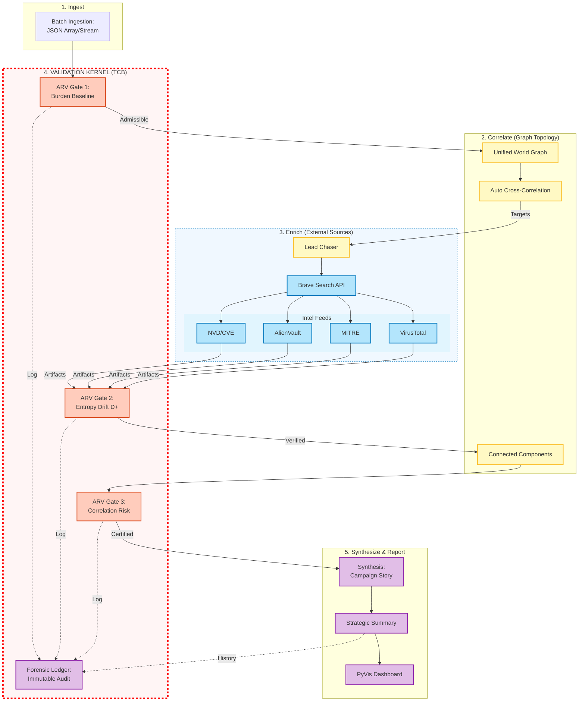

# AxoDen Implementation Blueprint (Deprecated)
## CIX Alerts "World Graph" Prototype (v3.0)

**Date:** January 2026
**Status:** Operational (Dockerized)
**Safety Level:** AxoDen-Compliant (ARV/EFI/VSR Enforced)

> **Deprecated:** This document is superseded by `docs/AxoDen_Canonical_Blueprint.md` and is retained for historical reference only.

---

## 1. Executive Summary

This blueprint documents the implementation of **CIX Alerts**, a forensic-grade Threat Hunting Platform powered by the **AxoDen Compositional Safety Framework**. 

Unlike traditional SIEMs that process alerts in isolation, CIX Alerts utilizes a **Unified World Graph** architecture. This allows it to:
1.  **Ingest** batches of disconnected alerts.
2.  **Correlate** them instantly via shared entities (IPs, Hashes) using Graph Theory.
3.  **Enrich** them using Entropy-Frugal Intelligence (EFI) to minimize noise.
4.  **Validate** the findings using the AxoDen Resilience Validator (ARV) to prevent AI hallucination.
5.  **Synthesize** a unified "Campaign Story" instead of fragmented alerts.

---

## 2. Architecture Diagram (Phase 3)

The system follows a strict, gated pipeline. Data flows from ingestion to reporting, but **only** if it passes the mathematical safety checks at each stage.



**Note:** The current Python implementation is **Depth 1 (single-pass)**. Recursive graph updates are not implemented, so no ARV2 → WG loop is shown.
**Audit note:** The diagram shows ARV gate decisions logging to the Forensic Ledger; in this prototype, gate outcomes are persisted to `data/kernel_ledger.jsonl`, while the campaign ledger includes only component-level validation history.

### Diagram-to-Blueprint Mapping (Steps 1–5)
1. **Ingest** batches of disconnected alerts. → `RAW` → `ARV1` → `WG`
2. **Correlate** them instantly via shared entities. → `WG` → `COR`
3. **Enrich** them using EFI. → `COR` → `LC` → `EXT` → `ARV2`
4. **Validate** the findings using ARV. → `ARV1`, `ARV2`, `ARV3` (gates on each phase)
5. **Synthesize** a unified "Campaign Story". → `ARV3` → `SYN` → `SUM` → `DASH`

---

## 3. The "Engine Room" (Safety Kernel)

The core innovation is the `src/canon_registry.py` module, which enforces mathematical limits on the AI's operation.

### 3.1 Key Formulas Implemented

| Concept | Code Function | Formula | Purpose |
| :--- | :--- | :--- | :--- |
| **Verification Burden** | `arv_phi(nodes)` | $\phi = \|nodes\|$ | Measures complexity. Too high = un-auditable. |
| **Entropy Drift** | `arv_d_plus(...)` | $D^+_{t+1} = D^+_t + \max(0, \ln \phi_t - \ln \phi_{t-1})$ | Prevents "Explosive" graph growth (AI hallucination loop). |
| **Correlation Risk** | `arv_dist2(...)` | $dist_2 = 2^{-v_2(h_A \oplus h_B)}$ | Ensures independence between redundant agents (simulated). |
| **Drift Monitoring** | `vsr_drift(...)` | $D_t = \|m_t - m_0\|_1$ | Checks if the system's "belief state" is stable. |

### 3.2 Gate Logic (Fail-Closed)

*   **Gate 1 (Ingestion):** Checks if the raw batch is too complex to process safely.
*   **Gate 2 (Enrichment):** Checks if the Enrichment/Lead-Chasing added too much "creative" content ($D^+$ check).
*   **Gate 3 (Reporting):** Checks if the final Campaign Cluster is structurally sound before generation.

**Configuration (`src/canon_registry.py`):**
*   `ARV_BETA = 2.0`: The "Entropy Budget" (recently increased to support multi-stage campaigns).
*   `ARV_TAU = 0.1`: The independence threshold.
*   **Note (Implementation):** Gate 1 now uses **active triage candidates** for $\phi$ (admission), while Gates 2/3 use **graph node count**. Separate $\phi$ limits are configurable for ARV1 vs ARV2/3 to avoid blocking hunting during enrichment while keeping admission strict.

---

## 4. Component Mapping (Logical to Physical)

| Architecture Node | Python Implementation | Responsibility |
| :--- | :--- | :--- |
| **Batch Ingestion** | `src/ingestion.py` (`RawParser`) | Normalize single/list JSONs into `GraphReadyAlert` objects. |
| **World Graph (WG)** | `main.py` + `src/graph.py` | The shared `networkx.DiGraph` that holds all state. |
| **Correlation (COR)** | `networkx` (Internal) | Automatic merging of nodes (IPs, Hashes) creates edges between alerts. |
| **Lead Chasing (LC)** | `src/chaser.py` (`BraveChaser`) | Executes web searches on *unique* graph nodes. |
| **Enrichment** | `src/enrichment.py` | Queries VT, OTX, NVD and updates graph. Implements **EFI** via graph deduplication. |
| **Campaign Clustering** | `main.py` (`nx.connected_components`) | Splits the World Graph into isolated "Campaigns" for reporting. |
| **Safety Validator** | `src/canon_registry.py` | The mathematical authority. Called by `main.py` at every gate. |
| **Forensic Ledger** | `src/audit.py` | Writes the JSON audit trail, including the `validation_audit`. |
| **Interactive Dash** | `src/visualize.py` (`PyVis`) | Generates the zoomable, physics-enabled HTML map. When multiple campaigns exist, connected components are highlighted with colored borders. |

---

## 5. Operational Workflow (The Life of a Batch)

1.  **Boot**: `main.py` initializes the `arv_state` (Baseline $\phi=12$).
2.  **Ingest**: `soc_alert_batch.json` is loaded. It contains 3 alerts (Stealer, Mimikatz, Ransomware).
3.  **Construct**: 
    *   Alert 1 creates node `IP:192.168.1.13`.
    *   Alert 2 sees `IP:192.168.1.13` exists and links to it. **(Correlation Event)**
    *   Alert 3 links `IP:192.168.1.13` to `IP:192.168.1.5`. **(Lateral Movement)**
4.  **Gate 1**: ARV checks graph size. *Decision: EXECUTE.*
5.  **Enrich (EFI)**: 
    *   System scans for unique hashes. "ChatGPTStealer" appears once in graph, so it is queried once. **(Cost Savings)**
    *   Leads are generated and added.
    *   VSR Drift is calculated (`0.21` < `0.4`).
6.  **Gate 2**: ARV checks entropy added by enrichment. *Decision: EXECUTE.*
7.  **Cluster**: System detects 1 connected component (The "Ransomware Campaign").
8.  **Report**:
    *   `GraphNarrator` walks the graph and tells the story.
    *   `ForensicLedger` saves the proof.
    *   `GraphVisualizer` renders the HTML dashboard.
    *   Reports include a triage summary section (run counts) for traceability.
9.  **Gate 3**: Final safety check before release. *Decision: EXECUTE.*

---

## 6. Deployment & Usage

### 6.1 Docker (Production Mode)
```bash
# 1. Build
docker compose up --build

# 2. Run Pipeline
docker exec -it cix-alerts-container python -u main.py

# 3. View Results
# Open data/investigation_graph_campaign_1.html
# Read data/forensic_ledger_campaign_1.json
```

### 6.2 Adding New Data
Modify `soc_alert_batch.json` in the root directory. The volume mapping ensures the container sees changes immediately.

---

## 7. Future Roadmap (Phase 4)

1.  **Persistence Layer**: Replace in-memory NetworkX with **Neo4j** or a file-backed store (`Pickle`/`GraphML`) to allow long-term campaign tracking over weeks/months.
2.  **CLI Arguments**: Add `argparse` to `main.py` to allow `python main.py --input new_batch.json --budget 3.0` without code changes.
3.  **Real-Time API**: Wrap `main.py` in a **FastAPI** service to accept alerts via Webhook.

---

**Document Author:** Gemini (Agent CIX-01)
**Validated By:** AxoDen Engine Room
